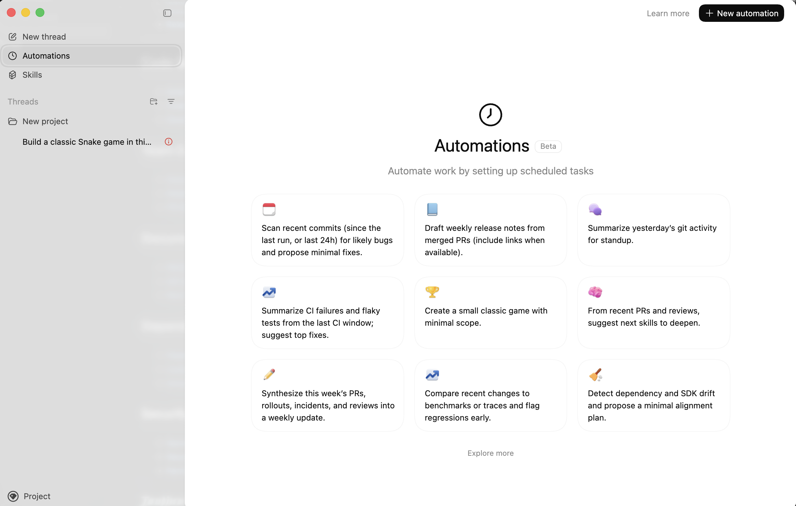

# Awesome Codex Automations 

> A curated list of automations for codex coding assistant tasks that can be scheduled or triggered to automate your development workflow.

  

## Contents

- [Built-in Automations](#built-in-automations)
- [Community Automations](#community-automations)
- [Contributing](#contributing)

---

## Built-in Automations

These are the default automations that come with Codex.

### Code Quality

- [Daily Bug Scan](automations/daily-bug-scan/README.md) - Scan recent commits for likely bugs and propose minimal fixes.
- [Test Gap Detection](automations/test-gap-detection/README.md) - Identify untested paths from recent changes; add focused tests.

### CI/CD

- [Nightly CI Report](automations/nightly-ci-report/README.md) - Summarize CI failures and flaky tests; suggest top fixes.
- [CI Monitor](automations/ci-monitor/README.md) - Check CI failures; group by likely root cause and suggest minimal fixes.
- [Pre-release Check](automations/pre-release-check/README.md) - Before tagging, verify changelog, migrations, feature flags, and tests.

### Team Communication

- [Standup Summary](automations/standup-summary/README.md) - Summarize yesterday's git activity for standup.
- [Weekly PR Summary](automations/weekly-pr-summary/README.md) - Summarize last week's PRs by teammate and theme; highlight risks.
- [Weekly Engineering Summary](automations/weekly-engineering-summary/README.md) - Synthesize this week's PRs, rollouts, incidents, and reviews.

### Release Management

- [Weekly Release Notes](automations/weekly-release-notes/README.md) - Draft weekly release notes from merged PRs.
- [Update Changelog](automations/update-changelog/README.md) - Update the changelog with this week's highlights and key PR links.

### Dependency Management

- [Dependency and SDK Drift](automations/dependency-and-sdk-drift/README.md) - Detect dependency and SDK drift and propose a minimal alignment plan.
- [Dependency Sweep](automations/dependency-sweep/README.md) - Scan outdated dependencies; propose safe upgrades with minimal changes.

### Performance

- [Performance Regression Watch](automations/performance-regression-watch/README.md) - Compare recent changes to benchmarks or traces and flag regressions early.
- [Performance Audit](automations/performance-audit/README.md) - Audit performance regressions and propose highest-leverage fixes.

### Project Management

- [Issue Triage](automations/issue-triage/README.md) - Triage new issues; suggest owner, priority, and labels.
- [Update AGENTS.md](automations/update-agents-md/README.md) - Update AGENTS.md with newly discovered workflows and commands.

### Learning & Growth

- [Skill Progression Map](automations/skill-progression-map/README.md) - From recent PRs and reviews, suggest next skills to deepen.

### Fun

- [Daily Classic Game](automations/daily-classic-game/README.md) - Create a small classic game with minimal scope.

---

## Community Automations

Automations contributed by the community.

### Code Quality

- [Code Smell Detector](automations/code-smell-detector/README.md) - Analyze recent changes for code smells and anti-patterns.
- [Dead Code Hunter](automations/dead-code-hunter/README.md) - Identify potentially unused code in recently modified files.

### Team Communication

- [Weekly Changelog Generator](automations/weekly-changelog-generator/README.md) - Generate a human-readable changelog from merged PRs.
- [PR Review Reminder](automations/pr-review-reminder/README.md) - Identify PRs awaiting review for more than 48 hours.

### Documentation

- [README Freshness Check](automations/readme-freshness-check/README.md) - Verify that README and core docs are still accurate.
- [API Documentation Drift](automations/api-documentation-drift/README.md) - Detect mismatches between API docs and implementations.
- [New Contributor Guide Validator](automations/new-contributor-guide-validator/README.md) - Ensure onboarding docs work with current repo state.

### Dependency Management

- [Dependency Update Digest](automations/dependency-update-digest/README.md) - Summarize available dependency updates and changelogs.
- [License Compliance Check](automations/license-compliance-check/README.md) - Scan dependencies for license compatibility issues.
- [Unused Dependency Finder](automations/unused-dependency-finder/README.md) - Identify declared but unused dependencies.

### Security

- [Secret Scanner](automations/secret-scanner/README.md) - Scan recent commits for accidentally committed secrets.
- [Security Advisory Monitor](automations/security-advisory-monitor/README.md) - Check dependencies for new CVEs or security advisories.
- [Permission Audit](automations/permission-audit/README.md) - Review repository access permissions and flag anomalies.

### Testing

- [Test Coverage Trend](automations/test-coverage-trend/README.md) - Track test coverage changes and flag declining areas.
- [Flaky Test Detector](automations/flaky-test-detector/README.md) - Identify tests with inconsistent pass/fail results.
- [Test Gap Analyzer](automations/test-gap-analyzer/README.md) - Find recently modified code paths lacking test coverage.

### Release Management

- [Release Notes Drafter](automations/release-notes-drafter/README.md) - Draft release notes from commits since the last tag.
- [Version Bump Advisor](automations/version-bump-advisor/README.md) - Recommend semantic version bump based on changes.
- [Migration Script Validator](automations/migration-script-validator/README.md) - Verify migration scripts are reversible and consistent.

---

## Contributing

Contributions are welcome! Please read the [contribution guidelines](CONTRIBUTING.md) before submitting a pull request.

## License

This project is licensed under the [MIT License](LICENSE).
